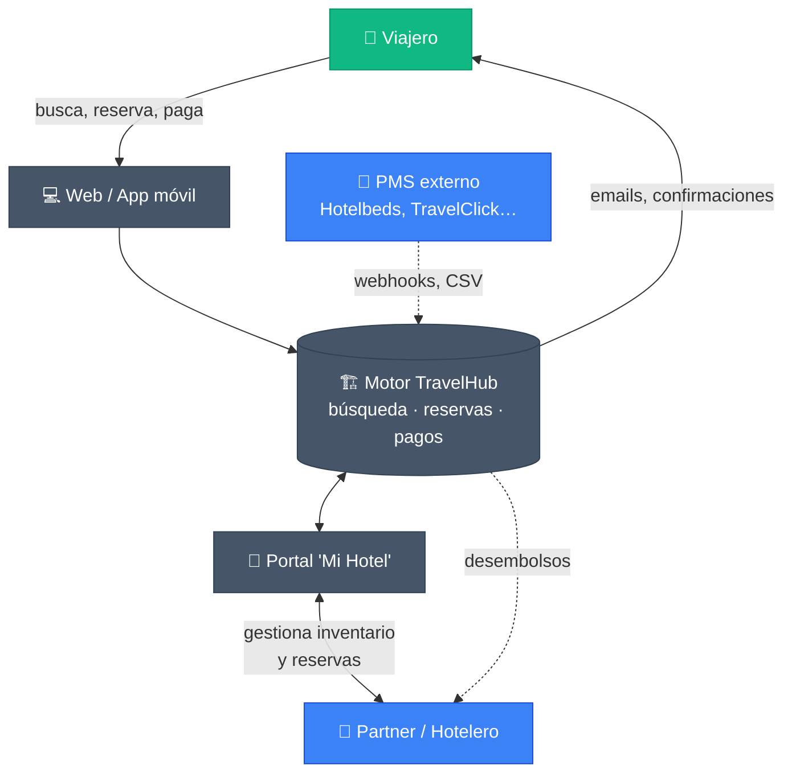

# 1. ¿Qué es TravelHub?

## En una frase

**TravelHub es un marketplace de alojamientos turísticos** que conecta a
**viajeros** que buscan dónde hospedarse con **hoteles, hostales y agencias**
que ponen sus habitaciones a la venta.

## Vista general

> 🟢 verde = lado de la **demanda** (viajero) · 🔵 azul = lado de la **oferta**
> (hotelero, PMS) · ⚫ gris = pieza interna de **TravelHub**.

## ¿Qué resuelve?

| Para el viajero | Para el hotelero |
|---|---|
| Encontrar un alojamiento que cumpla con su presupuesto, fechas y preferencias. | Llenar habitaciones vacías y ampliar canal de venta más allá del propio sitio web. |
| Reservar y pagar en un único lugar, con confirmación inmediata. | Cobrar las reservas, recibir liquidaciones y llevar el control financiero. |
| Hacer check-in con código QR sin tener que pasar largos trámites en recepción. | Gestionar tarifas, disponibilidad e inventario de habitaciones en tiempo real. |
| Recibir comunicaciones automáticas (confirmaciones, recordatorios, cancelaciones). | Tener un panel con métricas, ocupación, ingresos y desempeño por propiedad. |

## ¿En qué se diferencia?

TravelHub combina, en una sola plataforma, tres cosas que en el mercado suelen
estar separadas:

1. **Motor de búsqueda y reserva de cara al viajero**, accesible desde la web y
   la app móvil.
2. **Portal del partner**, con un dashboard de gestión hotelera completo:
   habitaciones, tarifas, calendarios, métricas, finanzas.
3. **Integración con sistemas hoteleros externos (PMS)** mediante webhooks e
   importaciones masivas — los hoteles pueden seguir trabajando con su PMS
   habitual y mantener su inventario sincronizado automáticamente.

## ¿Dónde se usa?

- **Aplicación web (frontend)** — accesible desde el navegador en computadora
  o móvil. La usan tanto viajeros como partners.
- **Aplicación móvil (iOS y Android)** — pensada principalmente para el viajero:
  búsqueda, reserva, gestión de viajes y check-in con QR.
- **Portal de partner** — vive dentro de la aplicación web, bajo la sección
  "Mi Hotel".

## Idiomas y monedas

- La interfaz está disponible en **español e inglés** (selector de idioma en el
  encabezado).
- Los precios pueden mostrarse en distintas **monedas** (USD por defecto;
  selector en el encabezado).
- Internamente todos los precios se almacenan en USD y se convierten al
  mostrarlos.

## Audiencia de esta guía

| Audiencia | Qué encontrarás |
|---|---|
| **Viajero** | Cómo buscar, reservar, pagar, cancelar, hacer check-in. |
| **Partner / hotelero** | Cómo registrarte, alta de propiedades, gestión de habitaciones, tarifas, métricas y desembolsos. |
| **Equipo corporativo / interno** | Visión funcional de la plataforma y de las responsabilidades de cada rol, sin entrar en detalle técnico. |
| **Administrador** | Vista general de las capacidades especiales del rol admin. |

> Esta es una guía **funcional**: no explica cómo está construida la plataforma
> por dentro. Para eso, consulta `CLAUDE.md` y la documentación técnica en `docs/`.
