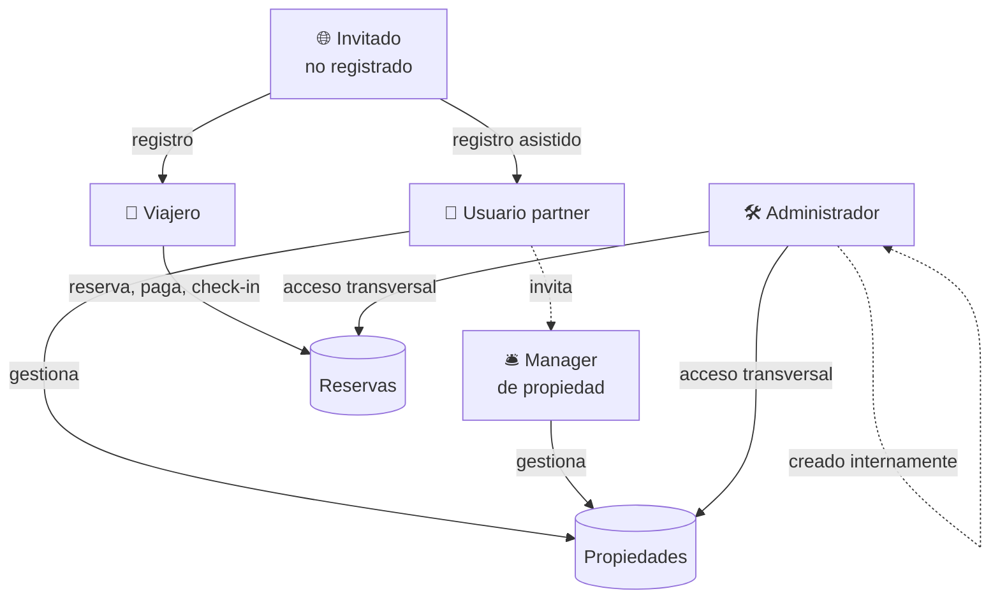

# 2. Usuarios y roles

TravelHub maneja **cuatro tipos de usuarios**. Cada uno ve una interfaz
diferente y tiene permisos distintos.

## Mapa de roles

## Resumen rápido

| Rol | ¿Quién es? | ¿Qué hace? | ¿Dónde lo usa? |
|---|---|---|---|
| **Invitado (no registrado)** | Cualquier visitante anónimo. | Buscar alojamientos y ver detalles. No puede reservar. | Web y móvil. |
| **Viajero (guest)** | Usuario registrado que reserva alojamiento. | Reservar, pagar, cancelar, hacer check-in, ver historial. | Web y móvil. |
| **Partner (hotelero)** | Cadena, hotel, hostal o agencia con propiedades. | Administrar propiedades, habitaciones, tarifas, reservas, finanzas. | Portal "Mi Hotel" en la web. |
| **Administrador** | Personal interno de TravelHub. | Acceso transversal a la plataforma. Soporte y operación. | Web. |

## Detalle por rol

### 🌐 Invitado (no registrado)

Cualquier persona que entra a TravelHub sin haber iniciado sesión.

**Puede:**
- Ver la página principal con propiedades destacadas.
- Buscar alojamientos por ciudad, fechas y huéspedes.
- Aplicar filtros (precio, amenities, tipo de habitación, estrellas, etc.).
- Ver el detalle de una propiedad y sus habitaciones.

**No puede:**
- Reservar — al pulsar "Reservar", el sistema le pedirá iniciar sesión o
  registrarse.
- Acceder al portal del partner ni a "Mis Reservas".

### 🧳 Viajero (guest)

El usuario más común. Se registra con email y contraseña y opcionalmente
configura autenticación en dos pasos (MFA).

**Puede:**
- Todo lo que puede hacer un invitado, **más**:
- Reservar una habitación (queda bloqueada 15 minutos para completar el pago).
- Pagar con tarjeta de crédito a través de Stripe.
- Ver el historial completo en **Mis Reservas** ("Trips" en la app móvil).
- Cancelar reservas activas y, según política, recibir un reembolso.
- Hacer **check-in con código QR** desde la app móvil cuando llega al hotel.
- Recibir notificaciones por email (confirmación, cancelación, check-out).
- Gestionar su perfil.

> El alta es gratuita y sin verificación de tarjeta hasta el momento de
> reservar.

### 🏨 Partner (hotelero)

Empresas u operadores que ponen alojamientos a la venta. Pueden ser desde una
**cadena** con muchos hoteles hasta un **hostal independiente** con una sola
propiedad.

**Tiene un portal propio** llamado **"Mi Hotel"**, organizado en pestañas:

- **Resumen** — métricas agregadas del partner (ingresos, ocupación, reservas).
- **Desembolsos** — historial de liquidaciones que recibirá del marketplace.
- **Propiedades** — listado de todos los hoteles / hostales del partner.
- **Equipo** — gestión de miembros del equipo (gerentes por propiedad).

Y para **cada propiedad** un dashboard con sus propias pestañas:

- **Resumen** — métricas de esa propiedad concreta.
- **Pagos** — pagos recibidos por reservas en esa propiedad.
- **Reservas** — listado de reservas y acciones (check-in, check-out, cancelar).
- **Habitaciones** — gestión del inventario por tipo de habitación.

Además, cada propiedad puede editarse con cinco subsecciones (información
básica, impuestos, fees, fotos y QR de check-in).

### 🛠️ Administrador

Personal interno de TravelHub (operaciones, soporte). Tiene **acceso total** a
través de la plataforma. Se usa para tareas como:

- Soporte: ver reservas y pagos de cualquier viajero o partner.
- Operación: corregir datos puntuales, atender disputas.
- Pruebas internas (los seeds incluyen un usuario admin de ejemplo).

> No existe (hoy) un panel dedicado de administración separado: el admin usa
> la misma aplicación, con permisos elevados.

## Cómo se obtiene cada rol

| Rol | Cómo se llega |
|---|---|
| Invitado | Por defecto, al abrir la app. |
| Viajero | Registro abierto desde `/register` en la web o desde la app móvil. |
| Partner | Registro asistido desde `/register/partner`. Se crea la organización y un usuario partner asociado. |
| Administrador | Creado manualmente por el equipo interno (no hay self-service). |

## Identidad y seguridad

- **Autenticación** — email + contraseña.
- **MFA opcional** — el viajero puede activar autenticación en dos pasos. Si
  está activa, al iniciar sesión recibe un código que debe introducir en la
  pantalla de MFA.
- **Sesión** — basada en token JWT. Caduca después de un tiempo de inactividad.
- **Datos personales** — los flujos de registro y baja cumplen con
  buenas prácticas de RGPD / LGPD (consentimiento, derecho de eliminación).
