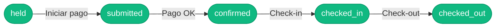
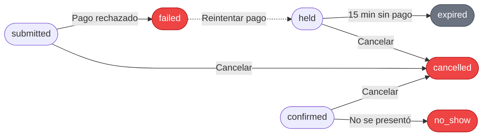

# 3. Funcionalidades para el viajero

Este capítulo describe **todo lo que un viajero puede hacer en TravelHub**.
Para guías paso a paso con capturas y secuencias, ver los capítulos 6 a 9.

## 3.1. Descubrimiento

### Página principal
Al entrar, el viajero ve:
- Un **buscador** central (ciudad, fechas, huéspedes).
- Una sección de **propiedades destacadas** con precio desde / noche.

### Búsqueda

Permite buscar alojamientos por:

- **Ciudad y país.**
- **Fechas** de entrada (check-in) y salida (check-out).
- **Número de huéspedes.**

La búsqueda devuelve resultados ordenados por relevancia. Cada resultado
muestra: imagen, nombre, ubicación, valoración y precio desde / noche.

### Filtros avanzados

Desde la página de resultados se pueden refinar por:

- Rango de **precio** (mínimo y máximo).
- **Amenities** (WiFi, piscina, gimnasio, desayuno incluido, etc.).
- **Tipo de habitación** (single, double, suite, etc.).
- **Tipo de cama** (queen, king, twin, etc.).
- **Tipo de vista** (mar, ciudad, jardín, etc.).
- **Categoría** (estrellas).

Los filtros se acumulan y se reflejan en la URL, por lo que la búsqueda es
fácil de compartir.

### Detalle de la propiedad

Al pulsar en un resultado, el viajero ve:

- **Carrusel de imágenes.**
- **Descripción** de la propiedad.
- **Ubicación** (barrio, ciudad, país).
- **Amenities** disponibles.
- **Reseñas** de huéspedes anteriores.
- **Lista de habitaciones** con precio para las fechas elegidas y botón
  "Reservar".

## 3.2. Reserva

### Carrito y hold de 15 minutos

Cuando el viajero pulsa "Reservar" sobre una habitación:

1. El sistema crea una **reserva en estado `held`** (retenida).
2. La habitación queda **bloqueada durante 15 minutos** para que nadie más
   pueda reservarla.
3. Si el viajero no completa el pago en ese plazo, la reserva pasa a `expired`
   y la habitación queda disponible de nuevo.

### Checkout

En la pantalla de checkout, el viajero:

- Revisa el **resumen de la reserva** (fechas, habitación, huéspedes).
- Ve el **desglose del precio**: base + impuestos + fees.
- Introduce los datos de la **tarjeta** (procesado por Stripe).
- Confirma el pago.

### Estados de una reserva

**Camino feliz** (de izquierda a derecha):

**Salidas alternativas** (estados no felices):

| Estado | Significado |
|---|---|
| `held` | Retenida (15 min) mientras se completa el pago. |
| `submitted` | Pago enviado a Stripe, esperando confirmación. |
| `confirmed` | Pago confirmado. La reserva está garantizada. |
| `checked_in` | El huésped ya hizo check-in. |
| `checked_out` | El huésped ya hizo check-out (estado final feliz). |
| `expired` | Se acabaron los 15 min sin pagar. La habitación se liberó. |
| `failed` | El pago falló. Puede reintentarse. |
| `cancelled` | Cancelada por el viajero o el partner. |
| `no_show` | El huésped nunca llegó. |

## 3.3. Pago

- **Procesador:** Stripe.
- **Métodos:** tarjeta de crédito y débito.
- **Reintentos:** si el pago falla, el viajero puede reintentarlo desde "Mis
  Reservas". El sistema vuelve a bloquear la habitación (`rehold`) y procesa
  un nuevo intento.
- **Multi-divisa:** los precios se muestran en la divisa elegida; el cobro
  se realiza en USD por defecto.

## 3.4. Mis Reservas (Trips)

Desde "Mis Reservas" en la web (o pestaña "Viajes" en la app móvil), el
viajero ve:

- **Pestañas Activas / Pasadas** (según el estado de la reserva).
- Por cada reserva: hotel, fechas, estado, precio total.
- Acciones contextuales:
  - **Completar pago** — si la reserva está en `held` (solo en pago pendiente).
  - **Cancelar** — si la política aún lo permite.
  - **Hacer check-in** — desde la app móvil, cuando llega el día.

## 3.5. Cancelación y reembolso

- El viajero puede **cancelar** una reserva en estados no terminales.
- Antes de confirmar la cancelación, ve una **cotización del reembolso** según
  la política aplicable (por ejemplo, 100% si cancela con suficiente
  antelación, parcial si se acerca la fecha, etc.).
- Una vez cancelada:
  - La reserva pasa a `cancelled`.
  - La habitación vuelve a estar disponible.
  - El reembolso se procesa según la política.
  - Se envían notificaciones por email.

## 3.6. Check-in con QR (solo móvil)

Cuando llega el día del check-in, el viajero puede saltarse la recepción:

1. Abre la app móvil → "Mis Reservas".
2. Selecciona la reserva del día.
3. Pulsa **"Hacer check-in"**.
4. **Escanea el QR** que tiene el hotel (en el lobby, en la puerta, etc.).
5. La reserva pasa a `checked_in` y la app muestra la confirmación.

## 3.7. Perfil y cuenta

- **Datos personales** — nombre, email, idioma preferido.
- **Cambio de contraseña.**
- **MFA (autenticación en dos pasos)** — opcional, recomendada.
- **Cierre de sesión** y **eliminación de cuenta** disponibles.

## 3.8. Notificaciones

El viajero recibe por **email** automáticamente:

- **Reserva confirmada** — al confirmarse el pago.
- **Reserva cancelada** — al cancelar.
- **Check-out completado** — al finalizar la estancia.

> Otras transiciones (held, submitted, failed, expired, no-show) suceden por
> dentro pero no generan email al viajero — se consideran ruido innecesario.
