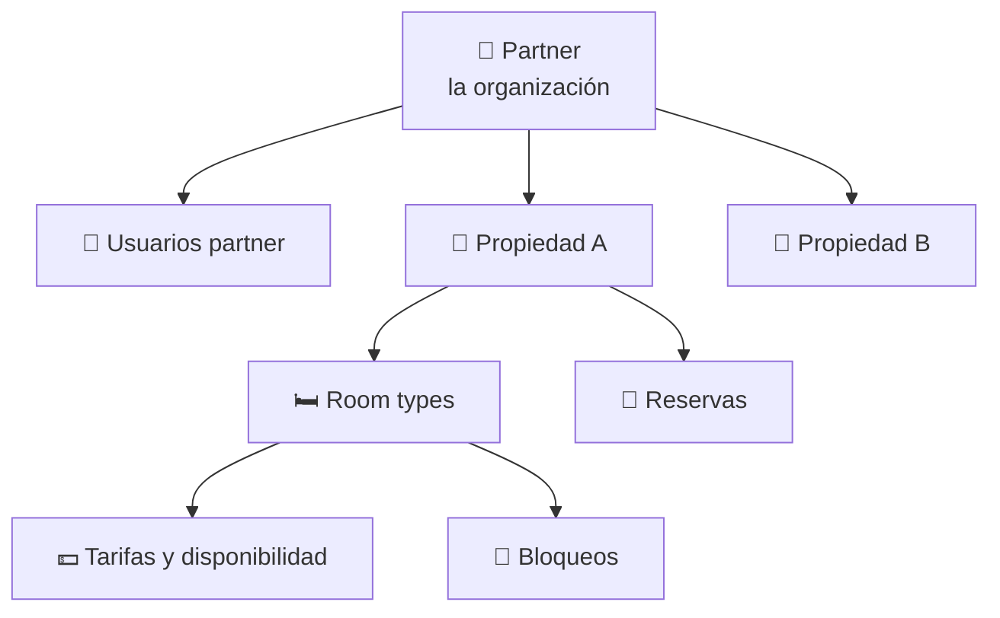

# 4. Funcionalidades para el partner (hotelero)

El partner es la organización (cadena, hotel, hostal o agencia) que pone
alojamientos a la venta en TravelHub. Su zona dentro de la web se llama
**"Mi Hotel"** y se accede desde el encabezado tras iniciar sesión.

Las guías paso a paso correspondientes están en los capítulos 10 a 13.

## 4.1. Estructura

Un partner está modelado así:

Una propiedad pertenece siempre a un único partner. Un partner puede tener
varias propiedades (cadena hotelera) o solo una.

## 4.2. Portal "Mi Hotel" — vista del partner

La página principal del portal tiene cuatro pestañas:

### Resumen (`/mi-hotel?tab=resumen`)
Vista ejecutiva consolidada del partner:

- **KPI cards** — ingresos totales, ocupación, reservas y ticket medio del mes.
- **Gráficos** — tendencia de ingresos por propiedad, comparativas mensuales,
  desglose por tipo de habitación.
- **Selector de mes** — permite ver datos del mes actual o de meses anteriores.
- **Movimientos del día** — operaciones de hoy (check-ins, check-outs, nuevas
  reservas).
- **Vista previa de desembolsos** — próximas liquidaciones.

### Desembolsos (`/mi-hotel?tab=desembolsos`)
Listado completo de **liquidaciones** (pagos que TravelHub hace al partner):

- Fecha, importe, estado, propiedades incluidas.
- Filtros por mes y por propiedad.
- Detalle de cada desembolso (qué reservas componen el monto).

### Propiedades (`/mi-hotel?tab=propiedades`)
Listado de todas las propiedades del partner:

- Nombre, ciudad, estado, número de habitaciones.
- Acceso al dashboard de cada propiedad.

### Equipo (`/mi-hotel?tab=equipo`)
Gestión del equipo del partner:

- Invitar usuarios para que accedan al portal.
- Asignar **gerentes (managers)** a propiedades concretas (esta asignación
  está parcialmente implementada — ver glosario).

## 4.3. Dashboard de una propiedad

Al entrar a una propiedad (`/mi-hotel/:propertyId`), el partner ve:

### Resumen (`?tab=resumen`)
- **KPI cards** específicos de la propiedad.
- **Gráficos** de ocupación, ingresos por habitación, comparativas.
- **Banner** con datos principales (foto, dirección, estrellas).

### Pagos (`?tab=pagos`)
- Listado de pagos recibidos por reservas en esta propiedad.
- Filtros por mes.
- Paginación.

### Reservas (`?tab=reservas`)
- Listado completo de reservas (todos los estados).
- Acciones por reserva:
  - **Check-in** (manual, sin QR — ver capítulo 12).
  - **Check-out.**
  - **Cancelación de partner** (`partner-cancel`, solo sobre reservas
    `confirmed`).
  - **Editar reserva** (datos de huésped, fechas no aún liberadas).

### Habitaciones (`?tab=habitaciones`)
- Listado de tipos de habitación (room types).
- Acceso al detalle de cada habitación.

## 4.4. Detalle de una habitación

`/mi-hotel/:propertyId/habitaciones/:roomId` muestra una vista profunda por
tipo de habitación:

- **Banner** con foto principal y datos del room type.
- **KPI strip** — métricas clave (ingreso, ocupación, ADR — Average Daily Rate).
- **Calendario** — vista mes a mes con celdas de color que indican el estado:
  disponible / reservada / bloqueada / saliente.
- **Plan de tarifas (Rate Plan)** — configuración del precio por noche.
- **Bloqueos (Blocks)** — fechas en las que la habitación no está a la venta
  por motivos del hotel (mantenimiento, evento privado, refurbishment, etc.).
- **Próximas reservas** — listado corto de las reservas próximas para esta
  habitación.
- **Editar habitación** — drawer lateral con datos descriptivos del room type.

## 4.5. Edición de la propiedad

Desde el botón "Editar propiedad" (`/mi-hotel/:propertyId/editar`), el partner
puede modificar todos los datos de la propiedad, agrupados en pestañas:

### Info
- Nombre, descripción, dirección, ciudad, país, coordenadas.
- Categoría (estrellas).
- Amenities a nivel propiedad.
- Horarios de check-in y check-out.

### Impuestos (Tax)
- Definición de impuestos aplicables (IVA, tasas locales, etc.).
- Porcentaje o monto fijo, por habitación o por reserva.
- Estos impuestos aparecen automáticamente en el desglose del checkout del
  viajero.

### Fees
- Fees adicionales (limpieza, resort fee, etc.).
- Igual que los impuestos, se aplican automáticamente y son visibles para el
  viajero antes del pago.

### Media
- Subida y orden de **fotografías** de la propiedad.
- Foto principal (thumbnail).

### QR
- **Generación del QR de check-in** para esta propiedad.
- Cada propiedad tiene una **clave de check-in (`check-in key`)** única.
- El QR contiene un *deep link* (`travelhub://checkin?key=...`) que el viajero
  escanea desde la app móvil para hacer check-in.
- El partner puede imprimir y colocar el QR en recepción, en la puerta, o
  donde considere.

## 4.6. Integraciones con sistemas externos (PMS)

Aunque la administración manual es posible, los partners grandes suelen
sincronizar TravelHub con su **PMS** (Property Management System) propio:

- **Webhooks entrantes** — el PMS notifica cambios (nuevas habitaciones,
  nuevas tarifas, disponibilidad) y TravelHub los aplica automáticamente.
- **Importación masiva por CSV** — carga inicial de inventario en grandes
  volúmenes.
- **Mapeo de IDs externos** — TravelHub mantiene una tabla que relaciona los
  IDs internos del PMS con los IDs internos de TravelHub.

Conectores predefinidos incluyen Hotelbeds, TravelClick y RoomRaccoon. El
flujo se gestiona desde un servicio independiente llamado
`integration-service` (no es visible para el partner; lo configura el equipo
de TravelHub junto con el partner).

## 4.7. Notificaciones que recibe el partner

Por **email**, el partner recibe:

- **Reserva cancelada** (asunto: "Reserva cancelada") — cuando un viajero
  cancela una reserva confirmada en una de sus propiedades.

Otras transiciones (confirmed, checked_out, etc.) notifican al viajero, no al
partner.
