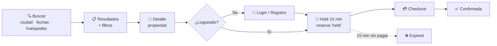

# 6. Cómo buscar y reservar (viajero)

Esta guía cubre el flujo completo desde "quiero ir a algún sitio" hasta tener
una reserva creada y bloqueada para pagar.

> Tiempo estimado: 3-5 minutos.

## Vista general del flujo

## 6.1. Buscar un alojamiento

### Paso 1 — Abrir TravelHub
- Web: entra a la página principal.
- Móvil: abre la app y ve a la pestaña "Buscar" (inicio).

### Paso 2 — Rellenar el buscador
En el cuadro de búsqueda del hero, indica:

- **Ciudad** (con sugerencias de autocompletado).
- **Fechas** — check-in y check-out.
- **Número de huéspedes.**

Pulsa **Buscar**.

### Paso 3 — Revisar los resultados
Verás un listado de propiedades que coinciden con tu búsqueda. Cada tarjeta
muestra:

- Foto principal, nombre, dirección.
- Valoración.
- Precio "desde" por noche.

> Los precios mostrados todavía no incluyen impuestos ni fees — los verás
> desglosados en el checkout.

### Paso 4 — Aplicar filtros (opcional)
A la izquierda (o detrás del icono de filtros en móvil) puedes refinar por:

- **Precio min / max.**
- **Amenities** (WiFi, piscina, parking, etc.).
- **Tipo de habitación.**
- **Tipo de cama.**
- **Tipo de vista.**
- **Estrellas.**

Los filtros se aplican en vivo y se reflejan en la URL.

## 6.2. Ver el detalle de una propiedad

Pulsa en una tarjeta. En el detalle verás:

- **Carrusel de fotos.**
- **Descripción** completa.
- **Mapa** y dirección.
- **Amenities** y servicios.
- **Reseñas** de huéspedes anteriores.
- **Habitaciones disponibles** para tus fechas, con precio total por estancia.

## 6.3. Reservar una habitación

### Paso 1 — Elegir la habitación
En la lista de habitaciones, pulsa el botón **"Reservar"** de la que te
interesa.

### Paso 2 — Iniciar sesión o registrarte
- Si **ya estás autenticado**, pasarás directamente al checkout.
- Si **no**, el sistema te llevará a iniciar sesión o registrarte.
  - El registro pide nombre, email y contraseña.
  - Al crear la cuenta, vuelves automáticamente al flujo de reserva.

### Paso 3 — El "hold" de 15 minutos
En cuanto pulsas "Reservar", la habitación queda **bloqueada para ti durante
15 minutos**:

- Tu reserva queda en estado `held` (retenida).
- Nadie más puede reservarla en ese intervalo.
- Verás una cuenta regresiva (o al menos sabrás que tienes ese límite).
- Si no completas el pago, la reserva pasa a `expired` y la habitación queda
  libre.

### Paso 4 — Revisar el resumen
En la pantalla de checkout verás un **panel resumen** con:

- Hotel y habitación.
- Fechas de check-in y check-out.
- Número de noches y huéspedes.
- **Desglose de precio:**
  - Subtotal (base).
  - Impuestos.
  - Fees adicionales.
  - **Total a pagar.**

> Continúa en [7. Cómo pagar una reserva](07-how-to-pay.md).

## 6.4. Consejos

- **Compartir una búsqueda** — la URL contiene todos los filtros, así que
  puedes enviarla por mensaje a quien viajará contigo.
- **Cambios de divisa / idioma** — el selector está en el encabezado y se
  aplica al instante.
- **Sesión caducada** — si la sesión expira durante el checkout, el sistema
  te pedirá iniciar sesión y, si llegas a tiempo, recupera la reserva
  `held`.

## 6.5. ¿Qué pasa si pierdo el hold?

Si los 15 minutos expiran:

- La reserva queda como `expired` y la habitación vuelve a estar disponible.
- Puedes reintentar la búsqueda y crear una nueva reserva — pero la
  habitación podría haberse reservado entretanto.
- Tu pago **no** se cobró (el cobro solo ocurre al confirmar en checkout).
