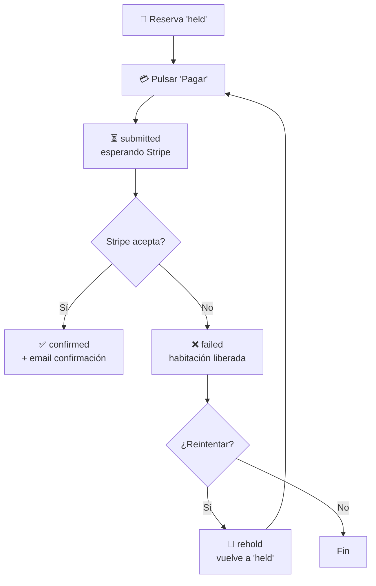

# 7. Cómo pagar una reserva (viajero)

Una vez que has creado una reserva (`held`), el siguiente paso es pagarla. El
pago se realiza con **tarjeta de crédito o débito**, procesado por **Stripe**.

## Flujo de pago (con reintento)

## 7.1. Antes de empezar

- Necesitas una **tarjeta válida** (Visa, Mastercard, Amex u otras aceptadas
  por Stripe).
- Asegúrate de tener **conexión estable** durante el proceso.
- Tienes **15 minutos** desde que creaste la reserva. Si superas ese tiempo,
  la habitación se libera.

## 7.2. Flujo de pago en la web

### Paso 1 — Llegar al checkout
Tras pulsar "Reservar" en la pantalla de detalle de propiedad y completar
inicio de sesión, llegarás automáticamente a `/booking/checkout`.

### Paso 2 — Revisar el resumen
A la derecha (o arriba en móvil) verás:

- Hotel y habitación.
- Fechas, huéspedes.
- **Desglose:** subtotal + impuestos + fees + **total**.

### Paso 3 — Introducir los datos de tarjeta
A la izquierda hay un formulario gestionado por Stripe (Stripe Elements):

- Número de tarjeta.
- Fecha de expiración.
- CVC.
- Código postal (en algunos países).

> Tus datos de tarjeta **nunca se almacenan en TravelHub**: viajan
> directamente a Stripe, que los tokeniza.

### Paso 4 — Confirmar el pago
Pulsa **"Pagar"**.

- Se envía la solicitud a Stripe.
- La reserva pasa de `held` a `submitted`.
- Si todo va bien, Stripe confirma el pago y la reserva pasa a `confirmed`.

### Paso 5 — Pantalla de confirmación
Una vez confirmada, verás:

- Mensaje de éxito.
- Detalles de la reserva.
- Botón para ir a "Mis Reservas".

También recibirás un **email de confirmación**.

## 7.3. Flujo de pago en la app móvil

El flujo es prácticamente idéntico al de la web:

1. Detalle de propiedad → "Reservar".
2. Login si hace falta.
3. Checkout con formulario de tarjeta (Stripe).
4. Confirmación.

## 7.4. ¿Y si el pago falla?

Si Stripe rechaza el pago (fondos insuficientes, tarjeta caducada, fraude
sospechado, etc.):

- La reserva pasa a estado `failed`.
- La habitación se **libera** (deja de estar bloqueada).
- Verás un mensaje de error indicativo.

**Para reintentar:**

1. Ve a "Mis Reservas".
2. Busca la reserva en estado `failed`.
3. Pulsa **"Reintentar pago"** o **"Completar pago"**.
4. TravelHub vuelve a **bloquear la habitación** (`rehold`) si todavía está
   disponible.
5. Reintroduce los datos (o usa otra tarjeta) y confirma.

> Si la habitación se reservó entretanto por otro viajero, no podrás
> reintentar y deberás buscar otra alternativa.

## 7.5. Múltiples intentos de pago

TravelHub conserva un **historial completo** de intentos de pago por reserva.
Cada reintento crea un nuevo registro de pago. Esto es importante para:

- **Auditoría** — saber cuántas veces se intentó y por qué fallaron.
- **Soporte** — si tienes que abrir una incidencia, el equipo puede ver el
  detalle.

## 7.6. ¿Cuándo se cobra realmente la tarjeta?

El cobro ocurre **al confirmar el pago en el checkout**. No hay
"pre-autorizaciones" durante el hold de 15 minutos: si la reserva expira
sin que pulses "Pagar", no hay ningún cargo.

## 7.7. Comprobantes

- Tras la confirmación, recibirás un email con el resumen.
- Desde "Mis Reservas" puedes consultar el desglose en cualquier momento.
- Si necesitas factura específica (fiscal), contacta con el partner directamente.

## 7.8. Multi-divisa

- Los precios pueden mostrarse en distintas monedas (USD por defecto).
- El cargo se realiza en USD; tu banco aplicará el tipo de cambio que
  corresponda.
