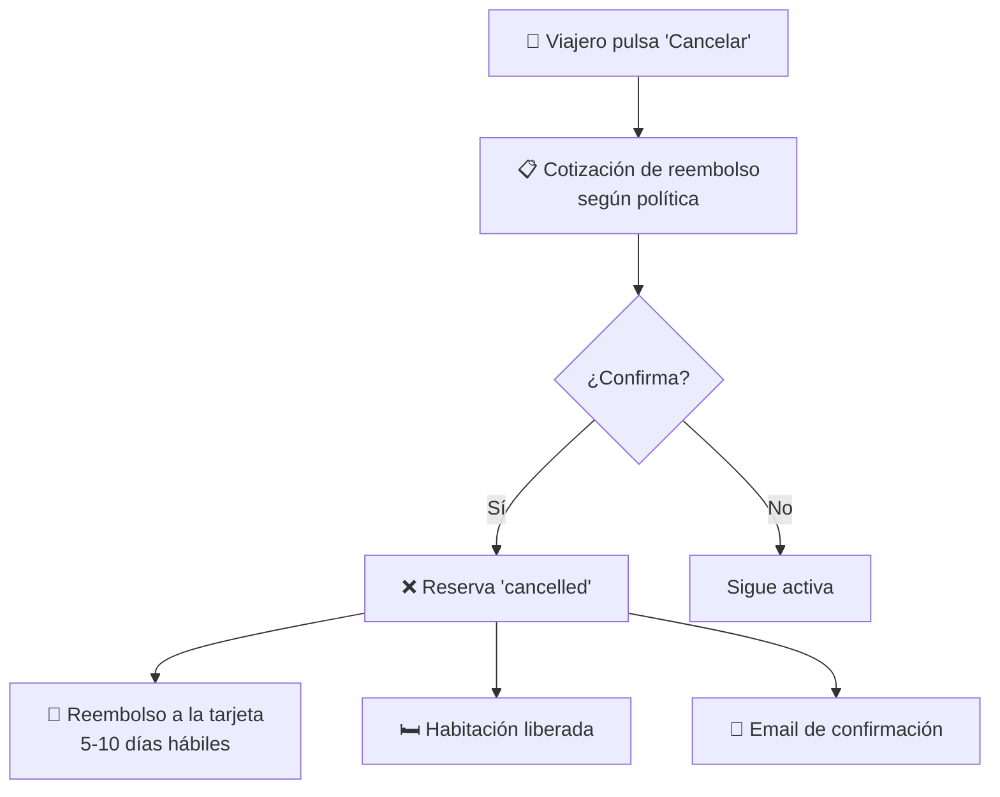

# 8. Cómo cancelar y solicitar reembolso (viajero)

Esta guía describe cómo cancelar una reserva y qué reembolso esperar según
el estado en que se encuentre.

## Vista general de la cancelación

## 8.1. ¿Qué reservas puedo cancelar?

Depende del **estado** de la reserva:

| Estado | ¿Cancelable desde la UI? | Comentarios |
|---|---|---|
| `held` | ❌ No (vía UI) | Se cancela sola al expirar el hold de 15 min. |
| `submitted` | ✅ Solo web | La cancelación aparece en la web; en móvil no. |
| `confirmed` | ✅ Web y móvil | Caso más común. |
| `checked_in` | ❌ | Ya pasaste la recepción; gestiona con el hotel. |
| `checked_out` | ❌ | Estancia ya completada. |
| `expired` | ❌ | Ya está cancelada por el sistema. |
| `failed` | ❌ | Pago fallido; no hay nada que cancelar. |
| `cancelled` | ❌ | Ya cancelada. |
| `no_show` | ❌ | Marcada como no-show; contacta soporte si crees que es un error. |

> Internamente, la API admite también el paso `held → cancelled`, pero las
> apps no exponen ese botón: las reservas `held` se gestionan a través del
> hold de 15 minutos.

## 8.2. Cancelar paso a paso

### Paso 1 — Ir a "Mis Reservas"
- Web: encabezado → "Mis Reservas".
- Móvil: pestaña inferior "Viajes" (Trips).

### Paso 2 — Encontrar la reserva
- Pestaña **Activas** — reservas en `held`, `submitted`, `confirmed` o
  `checked_in`.
- Por cada reserva ves: hotel, fechas, estado, total.

### Paso 3 — Pulsar "Cancelar"
- En web aparece en `submitted` y `confirmed`.
- En móvil aparece solo en `confirmed`.
- Verás un diálogo con la **cotización del reembolso**.

### Paso 4 — Revisar la cotización
El diálogo muestra:

- **Importe original** pagado.
- **Importe reembolsado** según política.
- **Penalización** (si la hay), por ejemplo:
  - 100% reembolso si cancelas con suficiente antelación.
  - 50% reembolso si cancelas dentro del periodo de penalización parcial.
  - 0% reembolso si cancelas demasiado tarde.

> La política exacta depende del partner / propiedad. La verás siempre antes
> de confirmar.

### Paso 5 — Confirmar la cancelación
Al pulsar "Sí, cancelar":

- La reserva pasa a `cancelled`.
- La habitación se libera y vuelve a estar disponible.
- Se inicia el reembolso (si aplica) hacia la tarjeta original.
- Recibirás un email confirmando la cancelación.

## 8.3. ¿Cuánto tarda el reembolso?

- El **dinero se devuelve a la misma tarjeta** con la que pagaste.
- Stripe procesa el reembolso al instante, pero **tu banco** puede tardar
  entre **5 y 10 días hábiles** en reflejarlo en tu cuenta.
- No es necesario que hagas nada adicional — es automático.

## 8.4. Cancelaciones iniciadas por el hotel

A veces el hotel cancela una reserva por su cuenta (sobreocupación, cierre
imprevisto, etc.). Esto se llama **partner-cancel**:

- Solo aplica a reservas `confirmed`.
- Recibirás un **email** notificándotelo.
- El reembolso correspondiente se procesa automáticamente.

> El reembolso por partner-cancel todavía no se conecta automáticamente con
> Stripe — el equipo de soporte de TravelHub puede iniciarlo manualmente si
> es necesario.

## 8.5. ¿Y si no llegué nunca (no-show)?

Si no llegaste y no cancelaste, la reserva pasa automáticamente a `no_show`
después de la fecha de check-in. Esto se considera **estancia facturable**
(igual que en hoteles tradicionales): la habitación queda como consumida y
**no hay reembolso automático**.

Si crees que la marca de no-show es incorrecta, contacta soporte con el ID
de tu reserva y los datos del incidente.

## 8.6. Preguntas comunes

**¿Puedo cancelar solo una noche de una reserva multi-noche?**
No: se cancela la reserva completa. Si solo quieres cambiar fechas, contacta
con el hotel para evaluar la posibilidad.

**¿Cancelar una reserva libera la habitación al instante?**
Sí. En cuanto la reserva pasa a `cancelled`, la habitación queda disponible
para el siguiente viajero.

**Me cobraron y no veo la reserva.**
Espera unos minutos: a veces la confirmación de Stripe tarda. Si tras 30
minutos sigue sin aparecer, contacta soporte con el ID de la transacción.
