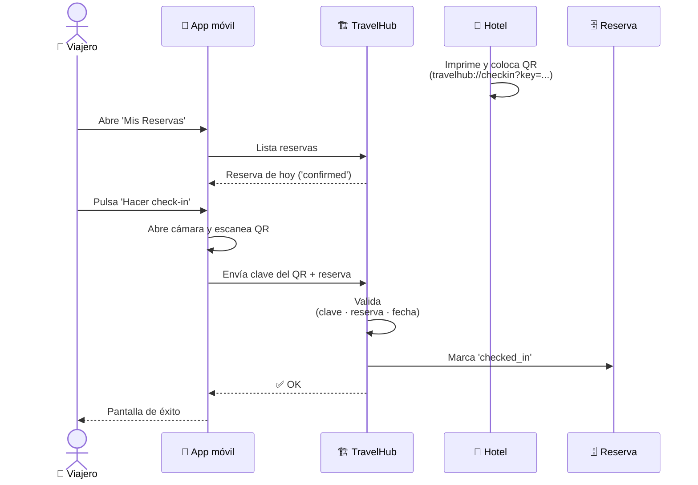

# 9. Cómo hacer check-in con QR (viajero, app móvil)

TravelHub permite saltarse la cola de la recepción usando un **código QR**
que el hotel coloca a la vista (lobby, puerta de habitación, recepción, etc.).
El check-in con QR está disponible **solo en la app móvil**.

## Secuencia del check-in con QR

## 9.1. Antes de llegar

- **Reserva confirmada** — solo las reservas en estado `confirmed` pueden
  hacer check-in (no `held` ni `submitted`).
- **Día del check-in** — la opción aparece el día previsto de entrada al
  hotel.
- **App móvil instalada** y sesión iniciada.

## 9.2. Flujo paso a paso

### Paso 1 — Abrir la app
Inicia sesión en TravelHub en tu teléfono.

### Paso 2 — Ir a "Mis Reservas"
Pestaña inferior **"Viajes"** (Trips).

### Paso 3 — Seleccionar la reserva del día
Verás la lista de tus reservas activas. La reserva con check-in **hoy**
aparece destacada con un botón **"Hacer check-in"**.

### Paso 4 — Pulsar "Hacer check-in"
La app abrirá el lector de QR (te pedirá permiso de cámara la primera vez).

### Paso 5 — Escanear el QR del hotel
- El hotel coloca un QR en zonas visibles: recepción, ascensor, puerta de la
  habitación.
- El QR contiene un *deep link* del tipo `travelhub://checkin?key=...`.
- La cámara reconoce el código y la app procesa el check-in.

### Paso 6 — Confirmación
Si todo es correcto:

- Tu reserva pasa a **`checked_in`**.
- La app muestra una pantalla de éxito con los datos clave (habitación, hora
  estimada de check-out).
- El hotel ve el cambio en su panel y sabe que ya estás dentro.

## 9.3. ¿Qué hace el QR exactamente?

Cada propiedad tiene una **clave única de check-in** (`check-in key`) que
solo conoce ese hotel. El QR codifica esa clave dentro del deep link.

Al escanear:

1. La app abre el deep link `travelhub://checkin?key=...`.
2. Envía la clave al backend junto con tu reserva y tu sesión.
3. El backend valida:
   - Que la clave corresponde a la propiedad reservada.
   - Que la reserva está en `confirmed`.
   - Que la fecha es la correcta.
4. Si todo cuadra, marca la reserva como `checked_in`.

Esto significa que **el QR solo funciona en el hotel correcto, para la
reserva correcta y el día correcto**. No se puede usar para hacer check-in
en otra propiedad.

## 9.4. Problemas comunes

**"La cámara no abre."**
Concede el permiso desde Ajustes del teléfono → TravelHub → Cámara.

**"El QR no se reconoce."**
- Asegúrate de que el QR pertenece al hotel donde te alojas.
- Aumenta el brillo de la pantalla del cartel si está sobre papel mal
  iluminado.
- Acércate lo suficiente para que el QR ocupe buena parte del visor.

**"Me dice que la reserva no está disponible para check-in."**
- Comprueba el estado: debe ser `confirmed`. Si está `held` o `submitted`,
  termina el pago antes.
- Comprueba la fecha: el check-in solo se permite el día previsto.

**"No tengo la app móvil."**
Hoy el check-in con QR está disponible solo en la app móvil. Pide al hotel
hacer el check-in tradicional en recepción.

## 9.5. ¿Y el check-out?

El check-out lo realiza **el partner** desde su panel cuando dejas la
habitación. No hay flujo de QR de salida desde la app del viajero.

Una vez que el partner marca check-out, recibirás un email
("Check-out completado") con el resumen de tu estancia.
