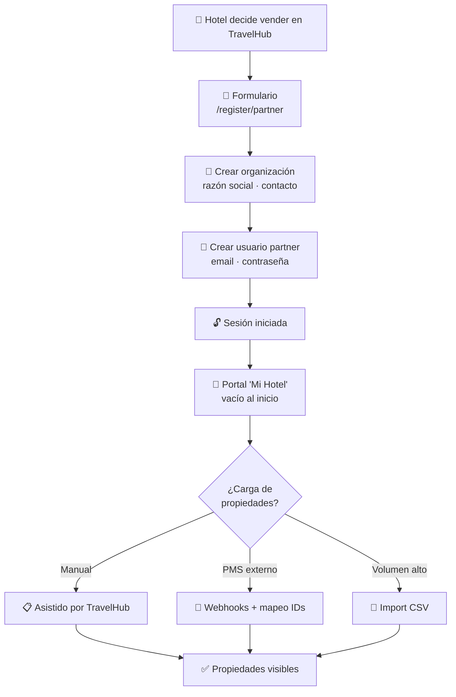

# 10. Cómo registrarse como partner

Esta guía describe el alta inicial de una organización (hotel, hostal, cadena,
agencia) en TravelHub como **partner**.

> Tiempo estimado: 10-15 minutos.

## Vista general del alta

## 10.1. Antes de empezar

Ten a mano:

- **Datos legales** de la empresa: razón social, ID fiscal, dirección.
- **Datos de contacto:** nombre, email, teléfono del responsable.
- **Datos bancarios** para recibir desembolsos.
- **Información de tus propiedades:** nombre, dirección, número de
  habitaciones, fotos básicas.

## 10.2. Crear la cuenta del partner

### Paso 1 — Ir al registro
En la web, accede a `/register/partner` (o pulsa "Soy hotel" / "Registrarme
como partner" en el encabezado).

### Paso 2 — Datos de la organización
Rellena:

- **Nombre comercial.**
- **Razón social.**
- **País / ciudad.**
- **Email principal.**
- **Teléfono.**

### Paso 3 — Crear el usuario partner
El responsable que rellena el formulario se convierte en el primer **usuario
con rol `partner`** de esa organización:

- Nombre y apellidos.
- Email (será su login).
- Contraseña.

Este usuario tendrá acceso completo al portal "Mi Hotel".

### Paso 4 — Confirmación
Al finalizar:

- Se crea la organización (partner).
- Se crea el usuario partner asociado.
- Se inicia sesión automáticamente.
- Aparece en el encabezado el enlace **"Mi Hotel"**.

## 10.3. Primer login en "Mi Hotel"

Al entrar por primera vez, el portal aparece prácticamente **vacío**:

- Pestaña **Resumen** — sin métricas porque todavía no hay reservas.
- Pestaña **Propiedades** — vacía. Aquí es donde añadirás tu(s) propiedad(es).
- Pestaña **Desembolsos** — vacía.
- Pestaña **Equipo** — solo apareces tú.

> El alta de propiedades hoy se realiza con el apoyo del equipo de TravelHub
> (importación masiva, conexión a PMS o carga manual asistida). Una vez que
> existen propiedades, podrás gestionarlas tú mismo desde el portal — ver
> [Cómo gestionar una propiedad](11-how-to-manage-property.md).

## 10.4. Conectar con tu PMS (opcional)

Si tu hotel ya usa un PMS (Property Management System) como Hotelbeds,
TravelClick o RoomRaccoon, puedes solicitar la integración:

- Webhooks entrantes: tu PMS notifica cambios y TravelHub los aplica.
- Importación masiva por CSV para la carga inicial.
- Mapeo de IDs externos a IDs internos.

Esta configuración la hace el equipo técnico de TravelHub junto con tu
equipo de sistemas; no es self-service.

## 10.5. Invitar a más miembros del equipo

Desde la pestaña **Equipo** del portal podrás:

- Invitar a otros usuarios partner (con acceso completo).
- Asignar **gerentes (managers)** a propiedades concretas (parcialmente
  implementado; ver glosario).

## 10.6. Buenas prácticas para partners nuevos

- **Foto principal de calidad.** Es lo primero que ve el viajero en los
  resultados; ten al menos una foto profesional.
- **Descripciones completas.** Información detallada → mayor conversión.
- **Política de cancelación clara.** Se mostrará al viajero antes de pagar.
- **Mantén la disponibilidad al día.** Especialmente en temporada alta:
  oversells frecuentes dañan la reputación.
- **Activa MFA en tu cuenta partner.** Es una cuenta con acceso financiero.

## 10.7. Próximos pasos

- [11. Cómo gestionar una propiedad](11-how-to-manage-property.md)
- [12. Cómo gestionar reservas y check-in/check-out](12-how-to-manage-reservations.md)
- [13. Cómo leer las finanzas y desembolsos](13-how-to-read-financials.md)
