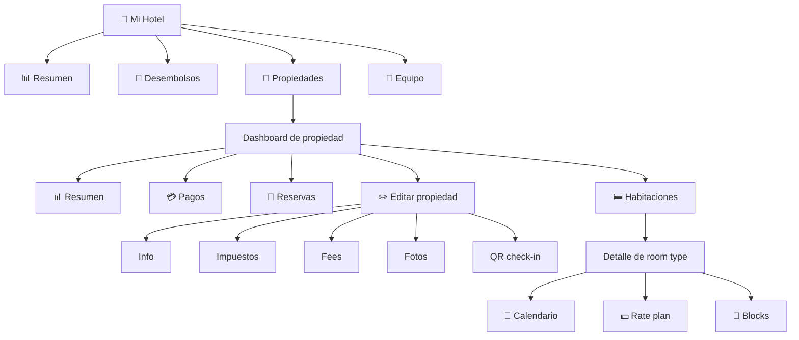

# 11. Cómo gestionar una propiedad (partner)

Esta guía cubre el día a día de un partner sobre **una propiedad concreta**:
información, impuestos, fees, fotos, QR de check-in, habitaciones, tarifas y
calendario.

## Vista del portal del partner

## 11.1. Entrar al dashboard de la propiedad

Desde "Mi Hotel" → pestaña **Propiedades** → pulsa en la propiedad que quieres
gestionar.

Llegarás a `/mi-hotel/:propertyId?tab=resumen` con cuatro pestañas:

| Pestaña | Contenido |
|---|---|
| Resumen | KPIs, gráficos, banner de la propiedad. |
| Pagos | Pagos recibidos por reservas de esta propiedad. |
| Reservas | Listado de reservas y acciones. |
| Habitaciones | Tipos de habitación (room types). |

## 11.2. Editar los datos de la propiedad

Pulsa **"Editar propiedad"** (o ve a `/mi-hotel/:propertyId/editar`). Tiene
cinco subpestañas:

### Info
Datos descriptivos:

- **Nombre comercial.**
- **Descripción** (texto largo, se muestra al viajero).
- **Dirección completa**: calle, barrio, ciudad, país, código postal.
- **Coordenadas geográficas** (para mapa y búsqueda geo).
- **Categoría** (estrellas, de 1 a 5).
- **Amenities** a nivel propiedad (parking, piscina, gym, etc.).
- **Horarios** de check-in y check-out por defecto.

Pulsa **Guardar** para aplicar.

### Impuestos (Tax)
Configura los impuestos que aplicarán automáticamente a cada reserva:

- **Nombre** del impuesto (ej. "IVA", "Tasa hotelera local").
- **Tipo:** porcentaje o monto fijo.
- **Valor.**
- **Base de aplicación:** sobre el subtotal o sobre cada habitación / noche.

> Estos impuestos aparecen automáticamente en el desglose que ve el viajero
> en el checkout.

### Fees
Cobros adicionales no fiscales:

- Limpieza, resort fee, gestión, etc.
- Configurados igual que los impuestos (% o monto fijo).
- También visibles para el viajero antes del pago.

### Media
Gestión de **fotos** de la propiedad:

- Sube nuevas fotos (jpg, png, etc.).
- Reordena por arrastrar y soltar.
- Marca **foto principal** (la que aparece en los resultados de búsqueda).
- Elimina las que ya no apliquen.

### QR
Genera el **código QR de check-in** de la propiedad:

- Cada propiedad tiene una **clave de check-in** única (`check-in key`).
- El portal muestra el QR listo para imprimir.
- Imprímelo y colócalo en recepción, en la puerta, o donde sea fácil
  escanearlo por el huésped al llegar.

> El QR no tiene fecha de caducidad, pero si rotas la clave (por motivos de
> seguridad) tendrás que reimprimirlo.

## 11.3. Gestionar habitaciones (room types)

Desde la pestaña **Habitaciones** del dashboard verás la lista de tipos de
habitación. Pulsa en uno para entrar al detalle (`/mi-hotel/:propertyId/habitaciones/:roomId`).

### Vista de detalle de habitación

- **Banner** con foto y datos principales del room type.
- **KPI strip** — ingreso, ocupación, ADR (Average Daily Rate).
- **Calendario** — vista mes a mes:
  - Verde: disponible.
  - Azul: reservada.
  - Rojo: bloqueada.
  - Gris: pasado.
- **Plan de tarifas (Rate Plan)** — precio por noche por temporada / fecha.
- **Bloqueos (Blocks)** — fechas en las que la habitación no está a la venta.
- **Próximas reservas** — lista corta de las siguientes reservas de este
  room type.

### Editar el room type
Pulsa **"Editar habitación"** y se abrirá un panel lateral con:

- Nombre y descripción.
- Capacidad (huéspedes max, camas).
- Amenities específicos del room type.
- Foto.

### Configurar tarifas (rate plan)

Para definir el precio:

1. En la tarjeta **Rate Plan**, pulsa "Editar".
2. Indica el precio base por noche.
3. Define excepciones por rango de fechas (temporada alta, eventos).
4. Guarda.

> Los cambios de tarifa se propagan al motor de búsqueda en segundos, así
> que el viajero ve siempre el precio actual.

### Bloquear fechas (blocks)

Si necesitas cerrar una habitación por mantenimiento, evento privado o uso
interno:

1. En la tarjeta **Blocks**, pulsa "Añadir bloqueo".
2. Indica rango de fechas y motivo.
3. Guarda.

Las fechas bloqueadas dejan de aparecer en los resultados de búsqueda
inmediatamente.

> Los bloqueos no afectan a reservas ya existentes para esas fechas — esas
> reservas siguen activas. Si necesitas cancelar reservas en bloque, hazlo
> manualmente desde la pestaña Reservas.

## 11.4. Sincronización con PMS

Si tu propiedad está conectada a un PMS externo:

- Los cambios en habitaciones, tarifas y disponibilidad pueden venir
  **automáticamente** desde tu PMS vía webhook.
- Cuando edites manualmente desde el portal, ten cuidado de no
  sobreescribir lo que tu PMS está enviando — coordina con tu equipo
  técnico la fuente de verdad por campo.
