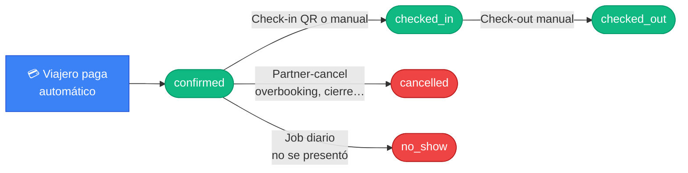

# 12. Cómo gestionar reservas (partner)

Esta guía describe el flujo del partner sobre las **reservas**: ver el
listado, hacer check-in y check-out, editar datos del huésped y cancelar
cuando sea necesario.

## Vista del partner sobre el ciclo de la reserva

> Donde empieza la acción del partner: una reserva ya **`confirmed`**.

## 12.1. Acceder a las reservas

Desde "Mi Hotel" → propiedad → pestaña **Reservas**
(`/mi-hotel/:propertyId?tab=reservas`).

Verás un listado con todas las reservas de esa propiedad. Cada fila muestra:

- ID o referencia de reserva.
- Huésped (nombre, email).
- Habitación reservada.
- Fechas de check-in y check-out.
- **Estado** (con badge de color).
- Importe total.
- Botones de acción contextual.

## 12.2. Estados que verás

| Estado | Significado para el partner |
|---|---|
| `held` | El viajero está pagando ahora mismo (no actúes). |
| `submitted` | Pago enviado a Stripe, esperando confirmación. |
| `confirmed` | Confirmada. Habitación garantizada. |
| `checked_in` | Huésped ya hizo check-in en tu propiedad. |
| `checked_out` | Huésped ya hizo check-out (estado final feliz). |
| `cancelled` | Cancelada (por viajero o por ti). |
| `no_show` | El huésped nunca llegó (marcada automáticamente). |
| `expired` | El hold de 15 min expiró sin pago. |
| `failed` | El pago falló. |

## 12.3. Hacer check-in (manual, desde el portal)

Si el huésped no puede o no quiere usar el QR de la app móvil, el partner
puede registrar el check-in manualmente:

1. Localiza la reserva (debe estar en `confirmed`).
2. Pulsa **"Check-in"** en la fila.
3. Confirma.
4. La reserva pasa a `checked_in`.

> El check-in con QR desde la app del viajero produce exactamente el mismo
> efecto. Usa la vía que prefieras.

## 12.4. Hacer check-out

Cuando el huésped deja la habitación:

1. Localiza la reserva (debe estar en `checked_in`).
2. Pulsa **"Check-out"**.
3. Confirma.
4. La reserva pasa a `checked_out` (estado terminal feliz).
5. El sistema envía un **email** automático al viajero con el resumen de la
   estancia.

## 12.5. Cancelar una reserva (partner-cancel)

Si por algún motivo necesitas cancelar una reserva confirmada (overbooking,
cierre imprevisto, etc.):

1. Localiza la reserva (debe estar en `confirmed`).
2. Pulsa **"Cancelar"**.
3. Confirma con el motivo.
4. La reserva pasa a `cancelled` y se notifica al viajero por email
   ("Reserva cancelada").
5. La habitación queda liberada para esas fechas.

> El reembolso al viajero por una cancelación iniciada por el partner
> todavía **no se procesa automáticamente** vía Stripe. Coordina con el
> equipo de soporte de TravelHub para emitir el reembolso correspondiente.

**Limitaciones del partner-cancel:**

- **Solo sobre `confirmed`.** No puedes partner-cancelar `submitted` (estaría
  cancelando un pago en curso, lo cual rompería el flujo con Stripe).
- **No sobre `checked_in`.** Si el huésped ya está dentro, lo correcto sería
  un check-out anticipado, no una cancelación.

## 12.6. Editar una reserva

Desde la lista, puedes entrar a la edición individual de una reserva
(`/mi-hotel/:propertyId/reservas/:reservationId/editar`):

- Corregir datos del huésped (nombre, documento, contacto).
- Notas internas (no visibles para el viajero).

> Las **fechas, habitación e importe** suelen ser inmutables tras la
> confirmación. Si necesitas un cambio mayor, coordina con el viajero
> para cancelar y crear una nueva reserva, o contacta soporte.

## 12.7. Reservas que aparecen sin acción tuya

### `no_show`
Una vez al día, TravelHub revisa las reservas `confirmed` cuya fecha de
check-in ya pasó **sin** que se hubiera registrado check-in. Esas reservas
se marcan automáticamente como `no_show` y se consideran **billables** (la
habitación queda como consumida — convención de la industria).

### `expired`
Si un viajero crea una reserva (`held`) y no paga en 15 minutos, el sistema
la marca automáticamente como `expired` y libera la habitación.

## 12.8. Movimientos del día (vista rápida)

En el **Resumen** del partner o de la propiedad, el bloque
"Movimientos del día" te da una vista compacta de lo que está pasando hoy:

- Check-ins previstos.
- Check-outs previstos.
- Reservas nuevas.
- Cancelaciones.

Es la pantalla más útil para la **recepción del día a día**.

## 12.9. Buenas prácticas

- **Revisa el QR** todos los días al abrir; asegúrate de que el cartel
  sigue ahí y legible.
- **Cierra check-outs el mismo día.** Una reserva en `checked_in` sin
  cerrar genera ruido en métricas y demora el envío del email de
  agradecimiento.
- **Documenta cancelaciones del partner** — usa siempre el motivo. Es
  importante para análisis de calidad.
- **No marques no-shows manualmente.** El sistema lo hace solo y de forma
  más justa.
