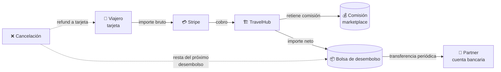

# 13. Cómo leer las finanzas y desembolsos (partner)

Esta guía explica cómo interpretar la información financiera del portal:
pagos recibidos, desembolsos del marketplace, y los reportes mensuales por
propiedad.

## 13.1. Concepto general

El flujo de dinero funciona así:

- **Pago** = lo que entra cuando un viajero reserva.
- **Desembolso** = lo que TravelHub te transfiere periódicamente al partner.
- **Comisión** = lo que TravelHub retiene por usar el marketplace.

## 13.2. Pestaña "Pagos" (de una propiedad)

Vive en `/mi-hotel/:propertyId?tab=pagos`. Muestra los pagos recibidos por
reservas de esta propiedad.

Por cada fila:

- Fecha del pago.
- Reserva asociada.
- Huésped.
- Importe bruto (lo que cobró el viajero).
- Comisión retenida por TravelHub.
- Importe neto para el partner.
- Estado del pago (capturado, reembolsado, fallido…).

**Filtros disponibles:**

- Por **mes** (selector en la cabecera).
- Paginación (por defecto cargados por bloques).

> Si un pago aparece como reembolsado, es porque la reserva se canceló y se
> devolvió el importe al viajero (parcial o totalmente).

## 13.3. Pestaña "Desembolsos" (del partner)

Vive en `/mi-hotel?tab=desembolsos`. Muestra las **liquidaciones** que
TravelHub realiza hacia tu cuenta bancaria.

Por cada desembolso:

- **Fecha** programada o efectiva.
- **Importe total.**
- **Estado** (programado, en tránsito, completado, fallido).
- **Propiedades incluidas** (qué hoteles entran en este desembolso).
- **Reservas asociadas** (al expandir el detalle).

**Filtros disponibles:**

- Por **mes.**
- Por **propiedad** (útil si tienes varias).

> El detalle de cada desembolso permite ver exactamente qué reservas
> componen el monto y conciliar contra tu sistema interno.

## 13.4. Vista previa en el Resumen

En la pestaña **Resumen** del partner aparece un bloque
**"Desembolsos próximos"** con un vistazo rápido sin tener que entrar al
detalle. Útil para saber qué pagos están en camino sin abandonar el dashboard.

## 13.5. KPIs del Resumen

Los **KPI cards** del Resumen agrupan métricas clave del mes seleccionado:

| KPI | Significado |
|---|---|
| **Ingresos** | Total facturado en reservas confirmadas (antes de comisión). |
| **Ocupación** | Porcentaje de noches vendidas sobre el total de noches disponibles. |
| **Reservas** | Número de reservas confirmadas en el periodo. |
| **Ticket medio** | Ingreso medio por reserva confirmada. |

Las KPI se calculan **por mes** y se pueden comparar con meses anteriores
usando el selector de mes.

## 13.6. Gráficos del Resumen

- **Tendencia de ingresos** — evolución diaria/semanal a lo largo del mes.
- **Por propiedad** — comparativa cross-propiedades (útil para cadenas).
- **Por tipo de habitación** — cuáles room types facturan más.

## 13.7. Conciliación con tu contabilidad

Buenas prácticas:

1. **Mensualmente**, descarga / revisa el listado de pagos del mes.
2. **Cruza** contra los desembolsos recibidos en banco:
   - `Σ (importes netos de pagos del periodo) = Σ (desembolsos de ese periodo)`
3. **Reembolsos** — apúntalos por separado: aparecen como importe negativo
   o como pago "refunded".
4. **Conserva el detalle** — TravelHub guarda el historial, pero tu
   contabilidad necesita el ID de reserva y el ID de pago.

## 13.8. Glosario rápido financiero

- **Importe bruto** — lo que pagó el viajero (con impuestos y fees).
- **Comisión TravelHub** — porcentaje que retiene el marketplace.
- **Importe neto** — lo que recibes tras la comisión (antes de impuestos
  propios).
- **Desembolso** — transferencia bancaria de TravelHub a tu cuenta.
- **Reembolso** — devolución al viajero por cancelación o disputa.
- **ADR** (Average Daily Rate) — ingreso medio por noche vendida.
- **Ocupación** — noches vendidas / noches disponibles, en un periodo dado.

## 13.9. Preguntas frecuentes

**¿Con qué frecuencia se hacen los desembolsos?**
Habitualmente mensual. La cadencia y los días exactos se acuerdan en el
contrato del partner.

**¿Qué hacer si un desembolso no llega?**
Verifica primero el estado en la pestaña Desembolsos. Si aparece como
"completado" pero no lo ves en tu banco, contacta con soporte adjuntando
el ID del desembolso.

**¿Las facturas se generan automáticamente?**
TravelHub genera el detalle financiero por reserva; la **factura fiscal**
formal sigue siendo responsabilidad del partner (cada país tiene su propio
formato fiscal). Usa el listado de pagos como base.

**¿Puedo descargar todos los datos?**
La exportación masiva (CSV / XLSX / PDF) está prevista en el roadmap y se
está añadiendo gradualmente endpoint a endpoint. Mientras tanto, los
filtros en pantalla cubren la mayoría de casos.
