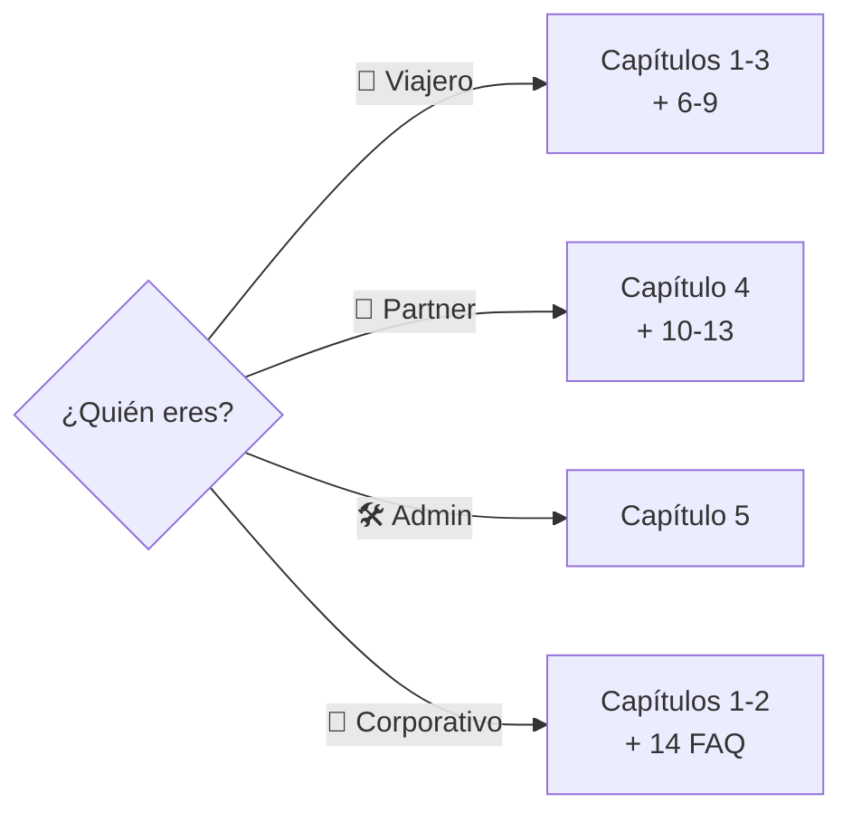

# Guía de Usuario de TravelHub

Bienvenido a la guía de usuario de **TravelHub**. Este documento está pensado para
audiencias **no técnicas**: viajeros, hoteleros (partners), equipos corporativos y
personal interno que quiera entender qué hace la plataforma y cómo se usa en el día
a día.

> ¿Buscas documentación técnica (APIs, microservicios, despliegue)? Consulta los
> demás archivos de `docs/` y el `CLAUDE.md` en la raíz del repositorio.

## Mapa rápido

> Los diagramas de esta guía usan **MermaidJS**. Se renderizan automáticamente
> en GitHub, GitLab, VS Code (con extensión) y la mayoría de visores Markdown
> modernos. Si los ves como texto plano, abre el archivo en uno de esos
> entornos.

## Índice

### Conceptos generales
1. [¿Qué es TravelHub?](01-introduction.md)
2. [Usuarios y roles](02-users-and-roles.md)

### Funcionalidades por rol
3. [Funcionalidades para el viajero](03-traveler-features.md)
4. [Funcionalidades para el partner (hotelero)](04-partner-features.md)
5. [Funcionalidades para el administrador](05-admin-features.md)

### Guías paso a paso — Viajero
6. [Cómo buscar y reservar](06-how-to-search-and-book.md)
7. [Cómo pagar una reserva](07-how-to-pay.md)
8. [Cómo cancelar y solicitar reembolso](08-how-to-cancel-and-refund.md)
9. [Cómo hacer check-in con QR](09-how-to-check-in.md)

### Guías paso a paso — Partner
10. [Cómo registrarse como partner](10-how-to-register-as-partner.md)
11. [Cómo gestionar una propiedad](11-how-to-manage-property.md)
12. [Cómo gestionar reservas y check-in/check-out](12-how-to-manage-reservations.md)
13. [Cómo leer las finanzas y desembolsos](13-how-to-read-financials.md)

### Referencia
14. [Glosario y preguntas frecuentes](14-glossary-and-faq.md)

## ¿Cómo leer esta guía?

- Si eres **viajero**, te recomendamos empezar por
  [¿Qué es TravelHub?](01-introduction.md) y saltar a las guías paso a paso de
  la sección "Viajero" (capítulos 6 a 9).
- Si eres **partner (hotel, hostal o agencia)**, empieza por
  [Funcionalidades para el partner](04-partner-features.md) y continúa con
  los capítulos 10 a 13.
- Si eres **personal corporativo o no técnico** que necesita una vista general,
  los capítulos 1 y 2 te dan el contexto suficiente en pocos minutos.
